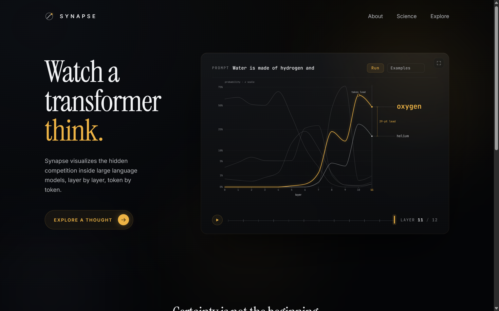
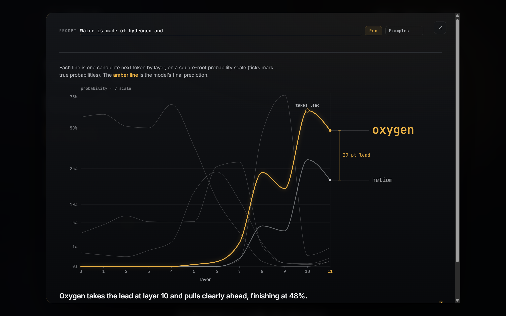
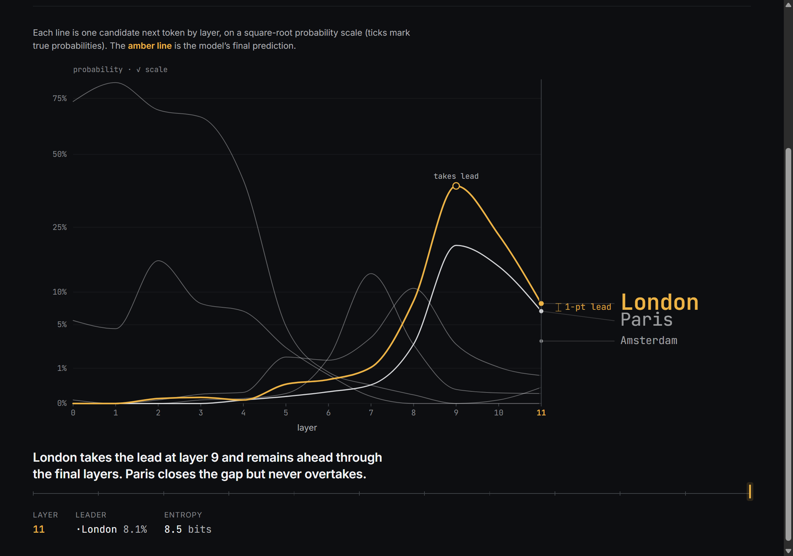
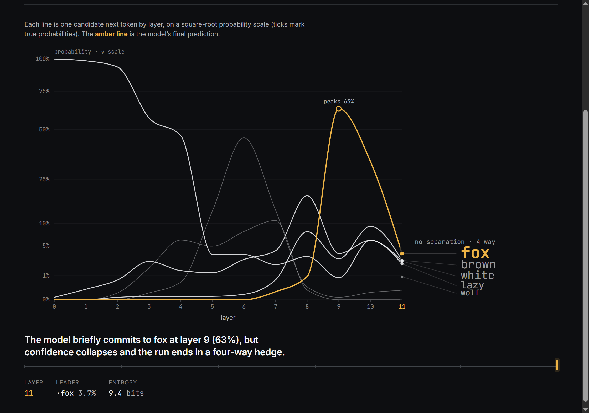

# Synapse

**Interactive mechanistic interpretability for GPT-2 — watch a transformer think, layer by layer.**

Type a prompt, run a real GPT-2 small forward pass, and watch the model's next-token
prediction assemble itself across the 12 layers. Synapse turns the **logit lens** (reading
the model's best guess out of the residual stream at every layer) into a single, continuous
picture called **The Race** — and then asks the question that actually matters:

> Not *"what word won?"* but **"did the model actually know?"**



---

## The experience

Synapse opens as a single editorial page built around the chart, not a dashboard. On load the
hero settles in and the chart **resolves itself** with a layer sweep (the forward pass made
legible). The page is the teaser; the chart is the centerpiece it orbits.

**Explore a thought** is the doorway. Pulling that lever doesn't navigate anywhere — the chart
**expands in place** out of its own position into the full instrument: the same analysis, now
with its layer scrubber, a per-layer readout (leader, probability, entropy), and the
researcher-voice thesis, over a blurred, focus-locked backdrop. Press Escape, the backdrop, or
close to settle it back. No route change, no "now loading the app".



The mark — **The Aperture** — is the chart in miniature: an instrument ring enclosing a
trajectory that climbs and resolves to a single gold node piercing the ring.

---

## What it demonstrates

Synapse re-implements a real, citable interpretability technique — the logit lens
([nostalgebraist, 2020](https://www.lesswrong.com/posts/AcKRB8wDpdaN6v6ru/interpreting-gpt-the-logit-lens);
[Belrose et al., 2023](https://arxiv.org/abs/2303.08112)) — and makes its behaviour legible:

- **Every layer is a guess.** For each of GPT-2 small's 12 layers, Synapse projects the
  residual stream through the model's own final layer-norm and unembedding to read that
  layer's top next-token prediction. Each tracked token becomes one line; the lines race.
- **The forward pass becomes one motion.** A steady sweep reveals the layers left to right,
  so you watch the prediction *form* rather than reading a finished chart. The winning line
  ignites amber at the layer where it takes the lead.
- **Doubt is physical, measured, and honest.** When the race resolves, the trajectories
  settle into *The Standing*: the candidates become words at their true final-layer height on
  the chart's own axis. The hero is the **moat**, the empty span between the winner and its
  nearest rival, drawn at their real probabilities and labelled with the lead in points. A
  wide moat means the model knew; a near-zero moat means it only leaned; a packed crowd with
  no moat means it never decided. The visualization never invents a gap the data doesn't have.

GPT-2 small is genuinely weak, and Synapse shows that truthfully. The three regimes:

| Prompt | What the model does | The moat |
|---|---|---|
| `Water is made of hydrogen and` | **Knew.** Oxygen pulls clearly ahead (48%). | A wide **29-pt** moat; oxygen stands alone, the also-rans recede. |
| `The Eiffel Tower is in the city of` | **Leaned, unsure.** London (8.1%) edges Paris (6.9%), and it's *wrong*. | A **1-pt** moat; London a hair above Paris, the field stays present. |
| `The quick brown fox jumps over the lazy` | **Didn't know.** A four-way hedge. | **No separation**; a tight pack of near-equals, no moat at all. |





---

## Run it

Two local processes: a Python backend that runs the model, and a Vite frontend that draws it.

### Backend (FastAPI + TransformerLens)

```powershell
cd backend
python -m venv .venv
.venv\Scripts\Activate.ps1
# CPU torch resolves faster from the official index:
pip install torch --index-url https://download.pytorch.org/whl/cpu
pip install -r requirements.txt

# Start the API (loads GPT-2 ~500MB on first run, then cached):
.venv\Scripts\python.exe -m uvicorn main:app --host 127.0.0.1 --port 8000
```

The server loads the model **once** at startup and holds it as a singleton. Swagger UI is at
`http://127.0.0.1:8000/docs`. CPU-only is fine — a forward pass is sub-second.

### Frontend (Vite + React + TypeScript + D3)

```powershell
cd frontend
npm install
npm run dev          # http://localhost:5173
```

The dev server proxies `/api` to the backend on port 8000, so start the backend first. Then
open `http://localhost:5173`: the landing boots into a live demo, and **Explore a thought**
(or the expand control on the chart) opens the full instrument, where you type a prompt or pick
a preset and run it.

---

## Architecture

```
Frontend (Vite + React + TS, D3)  ──POST /api/analyze──▶  Backend (FastAPI + HookedTransformer)
   The Race centerpiece           ◀──── JSON payload ────   GPT-2 small, loaded once at startup
```

- **Backend.** [TransformerLens](https://github.com/TransformerLensOrg/TransformerLens)'
  `HookedTransformer.run_with_cache` exposes every internal activation. `logit_lens.py`
  computes three things for the final position: per-layer top-k (`compute_logit_lens`),
  per-layer probability **trajectories** for a tracked token set (`compute_trajectories`),
  and per-layer Shannon **entropy** in bits (`compute_entropy`). The unembed includes the
  bias `b_U`, so the final-layer lens reproduces the model's real logits to ~1e-5.
- **Frontend.** `ClimbView.tsx` builds the D3 scene **once** per analysis (object constancy:
  lines are never recreated or reordered) and drives the whole picture from one value via
  `applyLayer(frontier)`: a clip reveals the trajectories up to the current layer, a playhead
  tracks it, the winner ignites, and at the final layer the trajectories resolve into *The
  Standing*, the words and the measured moat blooming in on the chart's own √ probability
  axis. That shared axis keeps early high-confidence spikes and the late low-probability race
  both visible, and makes the moat an honest reading of the real gap. State lives in a small
  Zustand store.
- **Honesty by construction.** The thesis sentence, the line-dimming at rest, and the moat
  (lead vs "no separation") are all derived from one shared event core (`climbEvents.ts`),
  gated on the same `decisive` test, so the words and the chart can never disagree.

### Project layout

```
backend/
  model.py          HookedTransformer singleton (loaded at import)
  logit_lens.py     compute_logit_lens / compute_trajectories / compute_entropy
  extract.py        run_with_cache once -> trimmed JSON payload
  main.py           POST /analyze, GET /attention/{layer}/{head}
frontend/src/
  components/
    ClimbView.tsx   The Race + The Standing (D3 centerpiece)
    climbEvents.ts  derived event core: winner, contenders, thesis, verdict
    ClimbScrubber / ClimbReadout   layer instrument + per-layer readout
  landing/          the cinematic page that wraps the instrument
    Hero / HeroChart / FocusOverlay   hero, framed chart, expand-to-deep-dive
    Fates / MiniClimb   the three-fate sparkline strip
    SiteNav / SiteFooter / SynapseLogo   ribbon, footer, the Aperture mark
    motion.ts       boot reveals + scroll parallax (reduced-motion aware)
  state/store.ts    Zustand: result, playhead layer, sweep state, focus mode
  api/client.ts     typed fetch wrappers
```

---

## Example prompts

- `Water is made of hydrogen and` — the clean "it knew" demo (oxygen).
- `The Eiffel Tower is in the city of` — the honest near-miss (London over Paris).
- `The quick brown fox jumps over the lazy` — an unresolved four-way hedge.
- `The first president of the United States was` — fact recall.
- `The capital of Japan is` — another retrieval case.

---

## Notes

- **Scope.** This is the logit-lens centerpiece. Attention visualization and deeper
  interpretability views (induction heads, neuron inspector) are planned but out of scope here.
- **Accessibility & motion.** The layer sweep is the signature motion and it conveys real
  meaning (information flowing through layers); the landing's boot reveals, ambient parallax,
  and the expand-to-deep-dive morph are calm and purposeful. Under `prefers-reduced-motion`
  everything falls back to an instant render, content is visible by default (never gated behind
  a transition), and the deep dive is a focus-locked `role="dialog"` reachable by keyboard.
- **Why GPT-2 small.** Small enough to run on CPU and to *understand fully*, large enough to
  show real fact recall. The point is the understanding, not the graphics.
